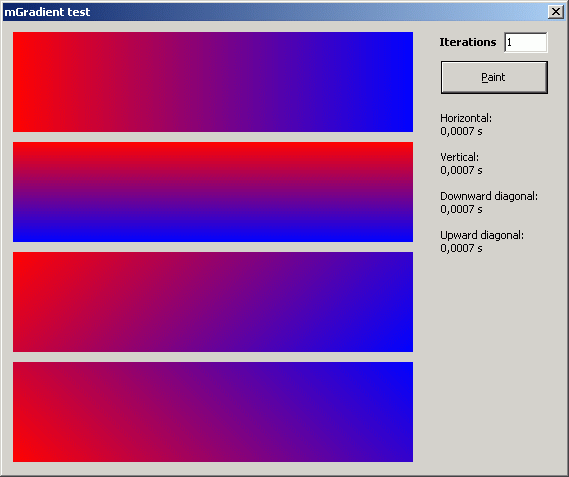

## Fast gradient \(horizontal, vertical and both diagonals\)

### Description

Fast gradient. Extension of a first post (Code ID 57192): now horizontal, vertical and both diagonals (45&#186;) :-) // Last update: 2005.05.14 (fixed diagonal gradient centering).
 
### More Info
 

             |
---                |---
**Submitted On**   |2005-05-15 16:27:04
**By**             |[Carles P\.V\.](https://github.com/Planet-Source-Code/PSCIndex/blob/master/ByAuthor/carles-p-v.md)
**Level**          |Intermediate
**User Rating**    |5.0 (45 globes from 9 users)
**Compatibility**  |VB 4\.0 \(32\-bit\), VB 5\.0, VB 6\.0
**Category**       |[Graphics](https://github.com/Planet-Source-Code/PSCIndex/blob/master/ByCategory/graphics__1-46.md)
**World**          |[Visual Basic](https://github.com/Planet-Source-Code/PSCIndex/blob/master/ByWorld/visual-basic.md)
**Archive File**   |[Fast\_gradi1888465152005\.zip](https://github.com/Planet-Source-Code/carles-p-v-fast-gradient-horizontal-vertical-and-both-diagonals__1-60477/archive/master.zip)

